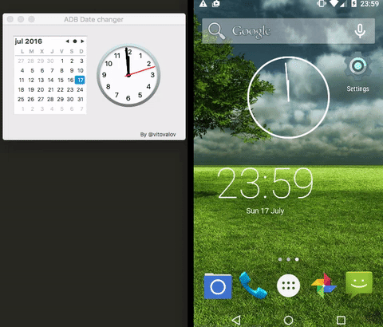

# ADB-Date-Changer
ADB Date changer is a small utility app for Android developers and for now only on OS X

##Requirements

- Root access. I recommend use Genymotion which by default gives you a rooted emulator. 

- Works for API 1..22. By some reason adb is not allowed to change date on API 23. 

- Automatic time disabled in [SETTINGS]. 

## See it in action

